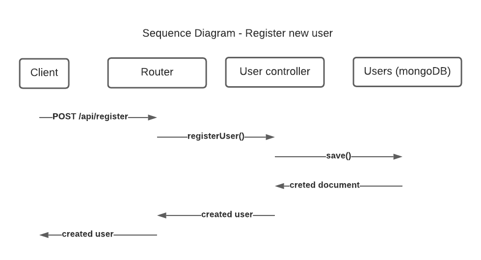
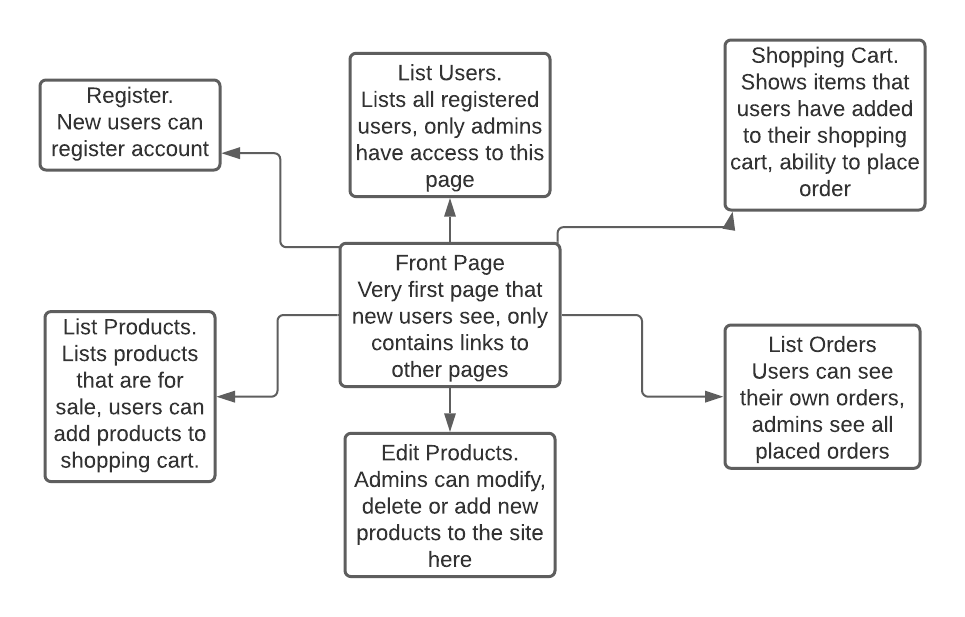

# Group

Member1:  Jaakko Humalajoki, jaakko.humalajoki@tuni.fi, 218890
- responsible for: Products handling (front- and back-end code), routes refactoring, accessibility grader, GitLab issues

Member2:  Joni Keinänen, joni.keinanen@tuni.fi, 267144
- responsible for: Orders handling (front- and back-end code), JSDoc grader, ESLint grader, Heroku deployment


# WebDev1 coursework assignment

A web shop built on vanilla HTML, CSS and Javascript.

We're aiming for a grade of +2, and we chose accessibility grader and product image implementation as optional features. Images are saved as a URL string that is dynamically added as an image tag on the products pages.

## Testing instructions

To test and run this project locally, follow these steps;

1) npm install
 - Installs all required modules to run the project

2) have mongoDB running as a service
 - MongoDB is a separate piece of software thats outside the scope of our project and needs to be installed separately

3) npm run reset-db
 - command fills the database with filler data to make testing easier, including adding the first default admin account required to add more admins later

4) npm start
 - Starts the server, running as long as the command line is kept open

After this, the website is available at http://localhost:3000 on any browser.

Default customer login =>
- username: customer@email.com
- password: 0987654321

Default admin login =>
- username: admin@email.com
- password: 1234567890

while logged in as admin, you can add new admins or delete users.


### The project structure

```
.
├── index.js                  --> connect to database, start server
├── package.json              --> holds metadata relevant to the project
├── routes.js                 --> main handleRequest, splits to other route files
├── productRoutes.js          --> request handler for products API calls
├── userRoutes.js             --> request handler for users API calls
├── orderRoutes.js            --> request handler for orders API calls
│
├── auth                      --> User authentication
│   └──  auth.js              --> handles user authentication
│
├── controllers               --> Controllers for database objects
│   ├── users.js              --> controller for user
│   ├── products.js           --> controller for product
│   └── orders.js             --> controller for order
│
├── models                    --> defines database and its schemas
│   ├── db.js                 --> connects/disconnect from database
│   ├── order.js              --> define order schema
│   ├── product.js            --> define product schema
│   └── user.js               --> define user schema
│   
├── public                    --> User interface, hmtl/css/js
│   ├── js                    --> javascript files
│   │ ├── adminUsers.js       --> behaviour in List Users page
│   │ ├── cart.js             --> behaviour in Shopping Cart page
│   │ ├── products.js         --> behaviour in List Products page
│   │ ├── adminProducts.js    --> behaviour in Edit Products page
│   │ ├── orders.js           --> behaviour in Orders page
│   │ ├── register.js         --> behaviour in Register page
│   │ └── utils.js            --> helper functions for other UI js files
│   └── css                   --> CSS files
│     └── styles.css          --> applies uniform styling to all pages
│
├── utils                     --> helper functions for router and controllers
│     ├── render.js           --> renders files from public directory
│     ├── requestUtils.js     --> functions related to HTTP request
│     ├── responseUtils.js    --> functions related to HTTP response
│
├── setup                     --> Sets up the store when server is started
│     ├── create-orders.js    --> creates orders
│     ├── products.json       --> defines products
│     ├── reset-db.js         --> resets database
│     ├── users.json          --> defines users
│
├── test                      --> tests
│   ├── auth                  --> tests for /auth/
│   ├── controllers           --> test for /controllers/
│   ├── models                --> tests for /models/
│   ├── utils                 --> test for /utils/
│   ├── routes.test.js        --> tests for router
│   ├── setup.test.js         --> Utility functions that prepare DB for testing
│   ├── ui.test.js            --> test for UI
│   └── own                   --> self-made tests
│     └── products.test.js    --> personal tests for products controller
│
└── rsc                       --> resources(e.g. images used in readme)


```

## The architecture

The website is built with Model-View-Controller (MVC) design pattern. That divides the program logic into three interconnected elements. The model represents data, in this case data is stored in mongoDB database. View represents the user interface, which is stored under the public folder in this project and controller is the request handler, which communicates with view and model. Purpose of MVC architecture is that view and model never interacts directly with each other and all communication goes through controller.

Communication between client and server is done with REST (representational state transfer) architectural style. Client and server are separated from each other and they use HTTP requests and responses to communicate with each other. Client sends HTTP Request to the server and server responses with  HTTP Response. The HTTP requests include HTTP methods e.g. GET, PUT, POST, that  tells the server how client wants to interact with server. HTTP requests might also contain data e.g. user data which should be stored on the server. Sequence diagram below shows how client-server interaction works when new user is created to the system. Process is similar to all HTTP methods.



## Pages and navigation
The app consist seven HTML pages: Front Page, Register, List Users, List Products, Edit Products, Shopping Cart and list Orders. Each pages header section have link to each other page, which makes navigation within the app easy. Rough diagram that shows the basic functionality of each page is shown below.



## Tests and documentation

Most of the code is tested by the premade mocha graders. In addition we created own tests to cover branches that wasn't tested by mocha graders. Our tests can be found in test/own folder.

During the group work, we didn't end up using issues as a way to manage the project work, instead opting to email each other to make it easier to discuss thoughts and ideas that didn't fit in the issues model.

We wrote our GitLab issues on feature and grader basis, and most of them don't have corresponding tests in the code.

- [Request handler for Products](https://course-gitlab.tuni.fi/webdev1-2020-2021/webdev1-group-48/-/issues/20) => /test/routes.test.js
- [Request handler for Orders](https://course-gitlab.tuni.fi/webdev1-2020-2021/webdev1-group-48/-/issues/21) => /test/routes.test.js
- [Products Schema](https://course-gitlab.tuni.fi/webdev1-2020-2021/webdev1-group-48/-/issues/13) => /test/own/products.test.js
- [Products model](https://course-gitlab.tuni.fi/webdev1-2020-2021/webdev1-group-48/-/issues/18) => /test/own/products.test.js
- [Orders Schema](https://course-gitlab.tuni.fi/webdev1-2020-2021/webdev1-group-48/-/issues/14) => test/routes.test.js
- [Orders model](https://course-gitlab.tuni.fi/webdev1-2020-2021/webdev1-group-48/-/issues/19) => test/routes.test.js
- [Adding new products through browser](https://course-gitlab.tuni.fi/webdev1-2020-2021/webdev1-group-48/-/issues/18) => no automatic tests, hand-tested
- [Modifying products through browser](https://course-gitlab.tuni.fi/webdev1-2020-2021/webdev1-group-48/-/issues/16) => no automatic tests, hand-tested
- [Products display an image on browser](https://course-gitlab.tuni.fi/webdev1-2020-2021/webdev1-group-48/-/issues/30) => no automatic tests, hand-tested
- [Orders displayed on browser](https://course-gitlab.tuni.fi/webdev1-2020-2021/webdev1-group-48/-/issues/22) => no automatic tests, hand-tested

## Security concerns

### Cross-site scripting

The website allows saving special characters as name, description, image etc, but when website reads these values it places the potentially harmful string safely into the HTML with .innerText attribute, rather than with the vulnerable .innerHTML. With this, names that might contain XSS attacks are safely displayed on screen as plain text.

### Session hijacking

The login is done with Basic authentication, which does a reversible encoding on the username:password pair. This is then sent over HTTP as plain text. This is unsecure, and it is possible to hijack the users session by reading the data package and copying the authentication token. Worse still, the users password can also be reverse-engineered from the encryption and an intuder could potentially access other websites with it as well. This could be avoided by using HTTPS protocol, but that was outside the scope of this course.

### Cross-site request forgery

Our website uses POST methods for sending orders as customer and adding new products as admin. This can be exploited with CSRF, where a different website could lure users who are already logged in on our website to click something which actually ends up sending a POST request on their behalf. A potential risk situation is that a hacker could buy expensive products on the users behalf and have them delivered to a safe location where they can collect it.

This could be mitigated or be fully fixed by following a same-origin policy, where the server would check the requests origin header before making changes. This website doesn't do that though.

### NoSQL injection

NoSQL injections can happen whenever user input is run directly to the database without sanitization. I'm not sure to which degree mongoose type validation helps to prevent injection vulnerabilities, but it would be a good idea to use a third party module to sanitize inputs before saving them.

### Directory traversal

Incoming page requests are sanitized by wrapping it inside URL() object and getting the filepath from that. This way the user shouldn't be able to request files outside of the public folder.

### Database data leak

The user information is saved as plain text except for the password, which is encrypted with bcrypt using a randomly generated salt. The encryption is unreverseable, so a hacker cannot figure out the original password but can get away with the other information.
